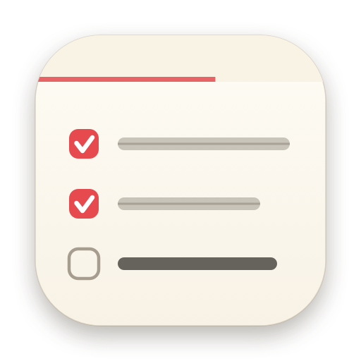
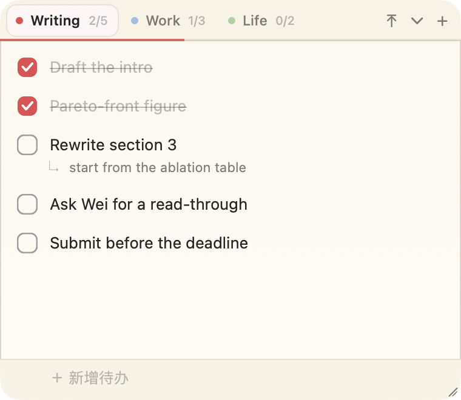
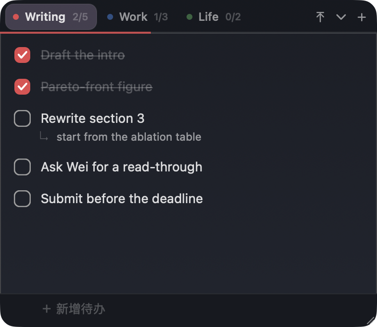
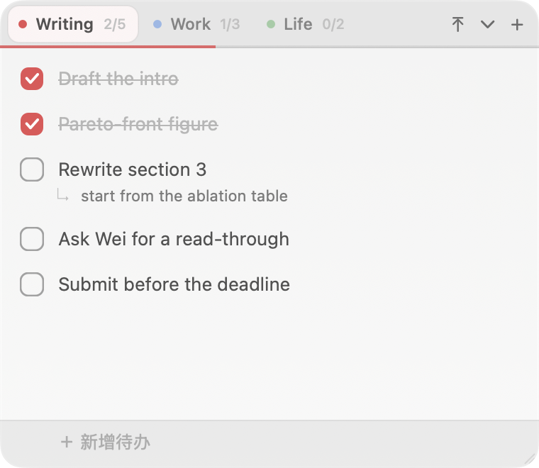

<div align="center">



# DeskNote

**贴在桌面上的清单便签，用完就自己收起来。**

[English](README.md) · [赞助](docs/DONATE.md)




</div>

---

## 这是什么

一个常驻桌面的小窗口，左边一列标签页，每个标签页一份清单，每行一个待办，点一下打勾。
它会浮在所有窗口上面（包括全屏应用）；把它拖到屏幕边缘，它会吸进去只留一条窄边，
鼠标扫一下窄边又滑出来。

不需要注册，不联网，不同步。所有数据就是
`~/Library/Application Support/DeskNote/` 下的两个 JSON 文件。

## 为什么会有它

试过的待办软件不外乎两类：一类是个完整的工作台，得专门打开去「用」它；
另一类是菜单栏下拉框，点一下别的地方就没了。
我想要的其实是以前贴在显示器边框上的那张纸便签 —— 干活的时候一直在视野里，
不需要的时候不碍事，一个动作就能收掉。

所以它是刻意做小的。没有项目层级，没有截止日期，没有重复任务，没有通知。
就是几份清单和一个勾。

## 功能

- **标签页清单** —— 可换颜色、重命名、加标签。
- **吸边** —— 拖到屏幕边缘会自动吸进去，留一条可悬停的窄边。上下左右都行。
- **自动收起** —— 吸边后，停止输入且鼠标移开就自己收回去。三档速度。
- **浮在最前** —— 盖在其他窗口上面，全屏应用也盖得住。
- **六套配色** —— 跟随系统、纸白、米黄、石墨、午夜蓝、毛玻璃。
- **两行式待办** —— 在某一行按 `Tab`，下面会展开一条小字副行，写不想放进标题里的细节。
- **标签筛选** —— 从菜单栏图标按标签隐藏整份清单。
- **只在菜单栏** —— 没有 Dock 图标，不出现在 ⌘Tab 里（`LSUIElement`）。
- **开机启动**，菜单栏里一个开关。
- **导出纯文本** —— 右键标签页 → 复制为文本。

<div align="center">

&nbsp;&nbsp;

</div>

## 安装

没有提供打包好的下载版。DeskNote 没有做苹果公证（notarize），下载来的 `.app`
会被 Gatekeeper 拦下来 —— 自己编译反而是最省事的路子。大概一分钟，不需要装
Xcode，只要命令行工具。

```sh
xcode-select --install        # 如果还没装过
git clone https://github.com/passionate11/DeskNote.git
cd DeskNote
./build.sh release
open DeskNote.app
```

`./build.sh release` 出的是通用二进制（`arm64` + `x86_64`），带 ad-hoc 签名。
想长期用就把 `DeskNote.app` 拖进 `/Applications`。
不带参数的 `./build.sh` 只编译当前架构且不优化，改代码时快一些。

需要 macOS 13 及以上。

## 怎么用

这个 App 没有标题栏也没有菜单栏，所有入口就两个：
**菜单栏图标**（☑︎）和**在便签上右键**。

| | |
|---|---|
| `⌘N` | 新建清单 |
| `⌘⇧H` | 显示 / 隐藏便签窗口 |
| `⌘Q` | 退出 |
| `回车` | 在当前项下面新建一条 |
| `Tab` | 跳到这一行的副行，再按跳回来 |
| `Esc` | 结束编辑（副行是空的就顺手删掉） |
| `↑` `↓` | 打字时在行之间移动 |
| `⌘Z` `⌘⇧Z` | 撤销 / 重做 |

⌘ 快捷键需要便签窗口处于焦点 —— 没有 Dock 图标，也就没有别的办法把焦点给它。
设置在菜单栏图标里。

右键标签页可以改颜色、重命名、加标签、清除已完成、复制为文本、删除。

**吸边：** 把窗口拖到贴着某条边再松手，它会吸进去留一条窄边。
要放回来，把它拖出来，或者右键 →「放回桌面」。

## 数据

```
~/Library/Application Support/DeskNote/
├── notes.json      你的清单
└── settings.json   窗口位置、主题、吸边方向
```

两个都是能直接看的 JSON，每次改动都会存。菜单栏图标 →「打开数据文件夹」
可以直接打开。想备份就自己备份，没有同步，以后也不会有。

## 已知的不足

- **界面只有中文。** 97 处文案是写死在代码里的。除此之外结构上没有障碍 ——
  把它们抽到 `Localizable.strings` 是个边界很清楚的入门任务，
  [欢迎来提 PR](https://github.com/passionate11/DeskNote/issues)。
- **只有一个窗口。** 多份清单是同一个窗口里的标签页，没法两张便签同时摊在桌面上。
- **不同步、没有手机端、没有提醒。** 这是故意的。

## 想改它

一共约 3000 行 AppKit，七个文件，零依赖，也没有包管理器：

| 文件 | |
|---|---|
| `Sources/Models.swift` | 数据模型、`Store`、主题与配色 |
| `Sources/BoardController.swift` | 窗口本体：吸边、自动收起、菜单 |
| `Sources/NoteViews.swift` | 标签栏、清单行、文本编辑 |
| `Sources/NoteWindow.swift` | 无边框窗口、拖动、取消位置约束 |
| `Sources/AppDelegate.swift` | 状态栏图标、悬停定时器、开机启动 |
| `Sources/MainMenu.swift` | 那个看不见但让 ⌘ 快捷键生效的主菜单 |
| `Tools/` | 生成图标、截图、探测显示器布局 |

欢迎 PR。注释写的基本都是「为什么这么写」而不是「这行在干嘛」 ——
看到哪段代码觉得别扭，上面的注释多半写了它是为了绕开哪个坑。

## 赞助

DeskNote 是免费的，MIT 协议，以后也不会变。
如果它值一杯咖啡，[这里有收款码](docs/DONATE.md) ——
不过点个 star 或者提一个写得清楚的 issue，其实比钱有用。

## 许可

[MIT](LICENSE) © 2026 passionate11
